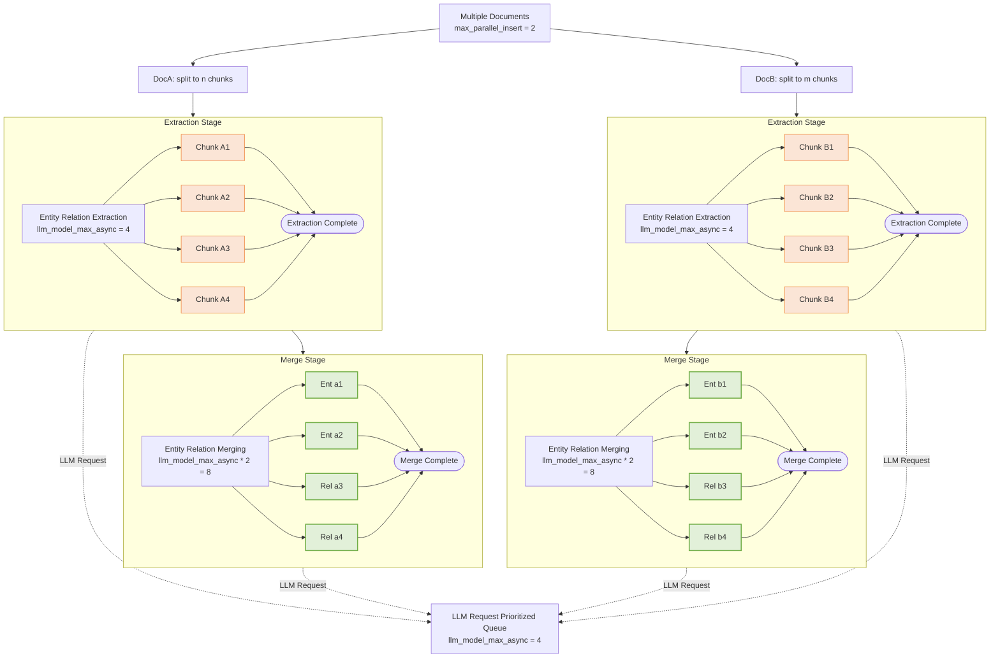

## LightRAG マルチドキュメント処理: 並行制御戦略

LightRAG は複数のドキュメントを処理する際に、多層的な並行制御戦略を採用しています。この記事では、ドキュメントレベル、チャンクレベル、LLM リクエストレベルでの並行制御メカニズムを詳細に分析し、特定の並行動作が発生する理由を理解するのに役立てます。

### 1. ドキュメントレベルの並行制御

**制御パラメータ**: `max_parallel_insert`

このパラメータは同時に処理されるドキュメント数を制御します。目的は、過度な並列処理によるシステムリソースの圧迫を防ぎ、個々のファイルの処理時間が長引くことを回避することです。ドキュメントレベルの並行性は LightRAG の `max_parallel_insert` 属性によって管理され、デフォルト値は 2 で、環境変数 `MAX_PARALLEL_INSERT` で設定可能です。`max_parallel_insert` は 2〜10 の間に設定することを推奨し、一般的には `llm_model_max_async/3` が適切です。この値を高く設定しすぎると、マージフェーズで異なるドキュメント間のエンティティやリレーションシップの命名競合が発生する可能性が高まり、全体的な効率が低下します。

### 2. チャンクレベルの並行制御

**制御パラメータ**: `llm_model_max_async`

このパラメータは、ドキュメント内の抽出ステージで同時に処理されるチャンク数を制御します。目的は、大量の並行リクエストが LLM 処理リソースを独占し、複数ファイルの効率的な並列処理を妨げることを防ぐことです。チャンクレベルの並行制御は LightRAG の `llm_model_max_async` 属性によって管理され、デフォルト値は 4 で、環境変数 `MAX_ASYNC` で設定可能です。このパラメータの目的は、個々のドキュメントを処理する際に LLM の並行処理能力を最大限に活用することです。

`extract_entities` 関数では、**各ドキュメントが独立して**独自のチャンクセマフォを作成します。各ドキュメントが独立してチャンクセマフォを作成するため、システムの理論的なチャンク並行数は以下のとおりです:
$$
ChunkConcurrency = Max Parallel Insert × LLM Model Max Async
$$
例:
- `max_parallel_insert = 2`（2つのドキュメントを同時処理）
- `llm_model_max_async = 4`（ドキュメントあたり最大4チャンクの並行処理）
- 理論的なチャンクレベルの並行数: 2 × 4 = 8

### 3. グラフレベルの並行制御

**制御パラメータ**: `llm_model_max_async * 2`

このパラメータは、ドキュメント内のマージステージで同時に処理されるエンティティとリレーション数を制御します。目的は、大量の並行リクエストが LLM 処理リソースを独占し、複数ファイルの効率的な並列処理を妨げることを防ぐことです。グラフレベルの並行性は LightRAG の `llm_model_max_async` 属性によって管理され、デフォルト値は 4 で、環境変数 `MAX_ASYNC` で設定可能です。グラフレベルの並列処理制御パラメータは、ドキュメント削除後のエンティティリレーションシップ再構築フェーズの並列処理管理にも同様に適用されます。

エンティティリレーションシップのマージフェーズではすべての操作で LLM の対話が必要なわけではないため、その並列度は LLM の並列度の2倍に設定されています。これにより、マシンの利用率を最適化しつつ、LLM に対する過度なキュー待ちのリソース競合を防止します。

### 4. LLM レベルの並行制御

**制御パラメータ**: `llm_model_max_async`

このパラメータは、ドキュメント抽出ステージ、マージステージ、ユーザークエリ処理を含む、LightRAG システム全体の LLM リクエストの**並行量**を管理します。

LLM リクエストの優先順位はグローバル優先度キューによって管理され、**ユーザークエリを体系的に優先**し、マージ関連リクエストよりも優先し、マージ関連リクエストは抽出関連リクエストよりも優先されます。この戦略的な優先順位付けにより、**ユーザークエリのレイテンシを最小化**します。

LLM レベルの並行性は LightRAG の `llm_model_max_async` 属性によって管理され、デフォルト値は 4 で、環境変数 `MAX_ASYNC` で設定可能です。

### 5. 完全な並行階層図

> 抽出ステージとマージステージは、`llm_model_max_async` によって制御されるグローバル優先度付き LLM キューを共有します。多数のエンティティおよびリレーションの抽出・マージ操作が「アクティブに処理中」である可能性がありますが、**同時に LLM リクエストを実行するのは限られた数のみ**であり、残りはキューに入れられて順番を待ちます。

### 6. パフォーマンス最適化の推奨事項

* **LLM サーバーまたは API プロバイダーの能力に基づいて LLM の並行設定を増やす**

ファイル処理フェーズでは、LLM のパフォーマンスと並行処理能力が重要なボトルネックとなります。LLM をローカルにデプロイする場合、サービスの並行処理容量は LightRAG のコンテキスト長要件を十分に考慮する必要があります。LightRAG は LLM が最低 32KB のコンテキスト長をサポートすることを推奨しているため、サーバーの並行数はこのベンチマークに基づいて計算する必要があります。API プロバイダーの場合、並行リクエスト制限によりクライアントのリクエストが拒否された場合、LightRAG は最大3回までリトライします。バックエンドログを使用して LLM のリトライが発生しているかどうかを確認し、`MAX_ASYNC` が API プロバイダーの制限を超えているかどうかを判断できます。

* **並列ドキュメント挿入設定を LLM の並行設定と整合させる**

並列ドキュメント処理タスクの推奨数は LLM の並行数の 1/4 で、最小値は 2、最大値は 10 です。並列ドキュメント処理タスク数を多く設定しても、通常は全体的なドキュメント処理速度が向上しません。少数の同時処理ドキュメントでも LLM の並列処理能力を十分に活用できるためです。過度な並列ドキュメント処理は、個々のドキュメントの処理時間を大幅に増加させる可能性があります。LightRAG はファイル単位で処理結果をコミットするため、大量の同時処理ファイルはかなりの量のデータのキャッシュを必要とします。システムエラーが発生した場合、中間ステージのすべてのドキュメントの再処理が必要となり、エラー処理コストが増加します。例えば、`MAX_ASYNC` が 12 に設定されている場合、`MAX_PARALLEL_INSERT` を 3 に設定するのが適切です。
